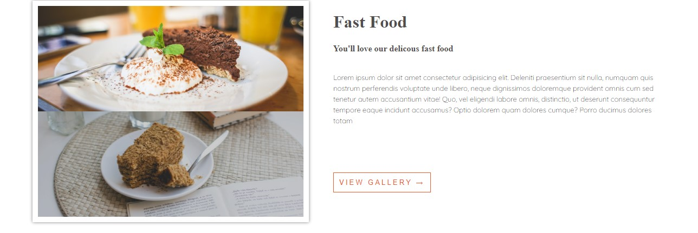
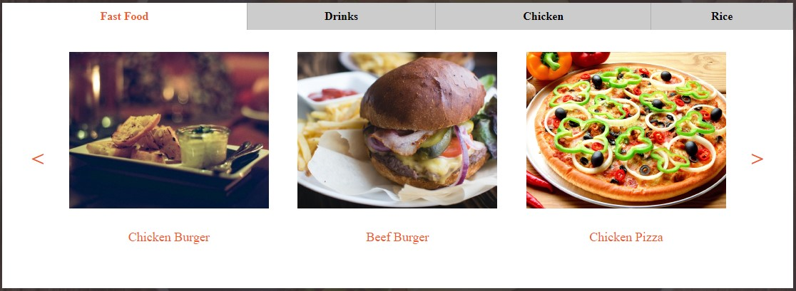
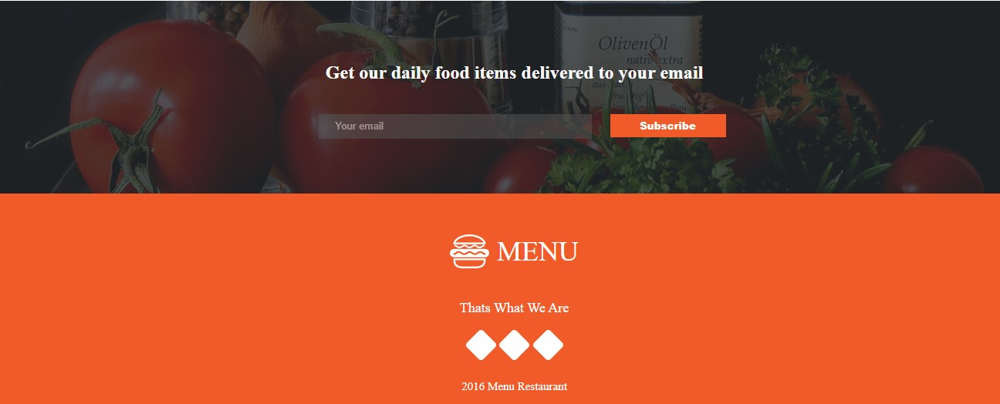

# Anitas-Kitchen

This website serves as a test of my skills to see how well I am doing academically. The kitchen platform provides a list of the products and services supplied, along with contact information. It has sufficient visual appeal to draw clients.

## Technologies Used
This project is build using:
* HTML5
* CSS
* Markdown

## Setup


* Not less than 1GB RAM
* Any OS would run it

## Installation 
To install, do this:
* Clone the repository to your local machine by typing the command on your *linux/Macos* `Terminal`. if you are using windows you will need gitbasg to run this command.
```
git clone https://github.com/titohritzy/anitas-kitchen.git

```
* Navigate into your working directory

```
cd anitas-kitchen

```
* Open the directory in Visual studio code or any text editor of your choice
* Open in Liveserver to see it on the browser.

## Screenshots
             
    
  
  
  
  
 

## Author
* Titus Kithome
  
## License

MIT License

Copyright (c) 2023 Titus Kithome

Permission is hereby granted, free of charge, to any person obtaining a copy
of this software and associated documentation files (the "Software"), to deal
in the Software without restriction, including without limitation the rights
to use, copy, modify, merge, publish, distribute, sublicense, and/or sell
copies of the Software, and to permit persons to whom the Software is
furnished to do so, subject to the following conditions:

The above copyright notice and this permission notice shall be included in all
copies or substantial portions of the Software.

THE SOFTWARE IS PROVIDED "AS IS", WITHOUT WARRANTY OF ANY KIND, EXPRESS OR
IMPLIED, INCLUDING BUT NOT LIMITED TO THE WARRANTIES OF MERCHANTABILITY,
FITNESS FOR A PARTICULAR PURPOSE AND NONINFRINGEMENT. IN NO EVENT SHALL THE
AUTHORS OR COPYRIGHT HOLDERS BE LIABLE FOR ANY CLAIM, DAMAGES OR OTHER
LIABILITY, WHETHER IN AN ACTION OF CONTRACT, TORT OR OTHERWISE, ARISING FROM,
OUT OF OR IN CONNECTION WITH THE SOFTWARE OR THE USE OR OTHER DEALINGS IN THE
SOFTWARE.
